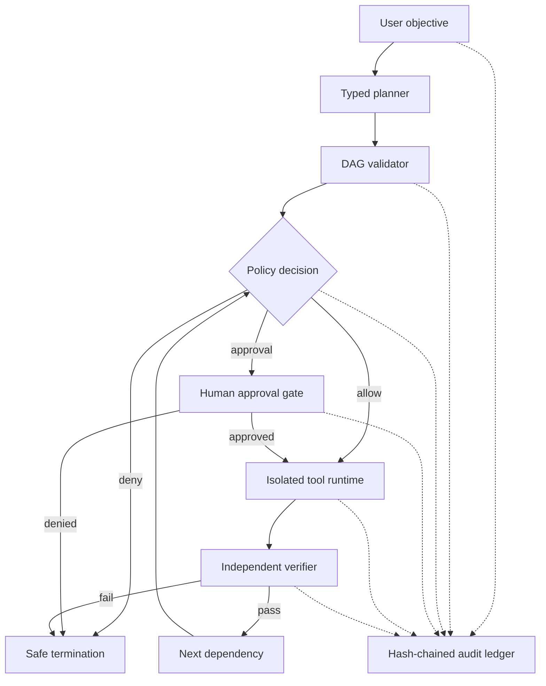

# PraxisMesh

**Verified agent operations for safely executing complex tasks.**

PraxisMesh is a research-grade execution platform where an AI planner proposes a typed task graph, but a deterministic trust kernel remains in control. Every tool call is validated against policy, risky mutations pause for human approval, results must pass independent verifiers, and all decisions are committed to a tamper-evident audit chain.

This repository contains a runnable vertical slice of the long-term platform: a local planner, an optional structured-output OpenAI planner, a policy engine, approval workflow, isolated artifact tools, verification registry, SQLite persistence, SHA-256 evidence ledger, FastAPI service, observability endpoint, and a responsive operations dashboard.

## Why this is different

Most agent demos treat a model's decision as permission to act. PraxisMesh separates intelligence from authority:

| Layer | Responsibility | Can the planner bypass it? |
| --- | --- | --- |
| Planner | Convert a goal into a typed dependency graph | No |
| Plan validator | Reject cycles, unknown tools and oversized plans | No |
| Policy engine | Allow, deny or request approval before a tool runs | No |
| Approval service | Record explicit human decisions for risky actions | No |
| Tool runtime | Enforce workspace and network boundaries again | No |
| Verifier registry | Prove postconditions using independent evidence | No |
| Audit ledger | Hash-chain every material transition | No |

The model can propose actions. It never grants itself authority.

## Working demonstration

The built-in scenario performs the complete control loop:

1. Capture and analyze a complex objective.
2. Compose a deterministic execution brief.
3. Pause before the persistent write.
4. Create a medium-risk approval request.
5. Resume only after approval.
6. Write inside an isolated run workspace.
7. Read the artifact back and verify its content and SHA-256 digest.
8. Verify the audit chain from genesis to head.

Run it without an API key:

```bash
python -m venv .venv
source .venv/bin/activate
python -m pip install -e ".[dev]"
praxismesh demo --auto-approve
```

The command exits non-zero if planning, execution, verification or audit integrity fails.

## Start the operations console

```bash
cp .env.example .env
docker compose up --build
```

Open [http://localhost:8000](http://localhost:8000). The interactive API contract is available at [http://localhost:8000/api/docs](http://localhost:8000/api/docs).

For local development:

```bash
python -m pip install -e ".[dev,openai]"
make dev
```

## Optional model-backed planning

The deterministic planner makes the repository reproducible and free to run. To use structured model output for plan generation:

```bash
export OPENAI_API_KEY="..."
export PRAXISMESH_PLANNER=openai
export PRAXISMESH_OPENAI_MODEL=gpt-5.6
praxismesh serve
```

The integration uses the Responses API with a Pydantic output schema. Generated plans still pass through the same independent validator, policy engine, approval service and verifier registry. See the official [OpenAI Structured Outputs documentation](https://developers.openai.com/api/docs/guides/structured-outputs).

## Architecture



The current runtime is intentionally single-service and dependency-light. The domain interfaces isolate the planner, repository, policy, tools, verifiers and ledger so later phases can distribute them without rewriting the trust model.

## Repository map

```text
backend/praxismesh/
  api.py               HTTP API, metrics and dashboard hosting
  orchestrator.py      Run state machine and dependency execution
  planner.py           Deterministic and structured-output planners
  policy.py            Pre-action allow/approval/deny guardrails
  tools.py             Bounded tools with defense-in-depth checks
  verifiers.py         Independent postcondition verification
  audit.py             Append-only SHA-256 event chain
  repository.py        SQLite run and approval persistence
frontend/               Dependency-free operations console
tests/                  Policy, DAG, ledger and E2E approval tests
docs/                   Architecture, threat model, evaluation and ADRs
infra/                  Docker, Prometheus and Kubernetes deployment
```

## API surface

| Method | Endpoint | Purpose |
| --- | --- | --- |
| `POST` | `/api/runs` | Validate and submit an objective |
| `GET` | `/api/runs` | List persistent execution records |
| `GET` | `/api/runs/{id}` | Inspect a plan and step states |
| `POST` | `/api/runs/{id}/execute` | Resume an eligible run |
| `GET` | `/api/runs/{id}/approvals` | Inspect approval history |
| `POST` | `/api/runs/{id}/approvals/{approval}` | Approve or deny a gated action |
| `GET` | `/api/runs/{id}/events` | Read the run's evidence trace |
| `GET` | `/api/runs/{id}/artifacts` | List verified workspace artifacts |
| `GET` | `/api/metrics` | Read operational metrics as JSON |
| `GET` | `/metrics` | Prometheus exposition format |
| `GET` | `/health` | Service and audit-integrity health |

## Safety invariants

- Plans are data, never executable code.
- Only registered tools can appear in a validated plan.
- The plan must be an acyclic graph within a configurable step budget.
- Secret-like material is denied before tool dispatch.
- Persistent writes require explicit approval.
- Artifact paths cannot escape the run workspace.
- HTTP is disabled by default; when enabled, only HTTPS allowlisted hosts are accepted.
- A successful tool call is insufficient: its verifier must also pass.
- Terminal success requires every plan step to be verified.
- Audit events commit to the complete previous event hash.

See [docs/threat-model.md](docs/threat-model.md) for assets, actors, trust boundaries and mitigations.

## Testing and quality

```bash
make test
make lint
praxismesh verify-ledger
```

The current suite covers:

- valid and cyclic dependency graphs;
- unknown-tool rejection;
- bounded transform authorization;
- workspace-escape and destructive-command denial;
- persistent-write approval requirements;
- pause, approve, resume and verified completion;
- denial-driven safe termination;
- audit-chain integrity and tamper detection.

CI runs on Python 3.11 and 3.12, lints the code, runs tests with coverage, compiles the package and builds the hardened container image.

## Research direction

PraxisMesh is designed to support publishable evaluation, not only a polished demo. The proposed study compares unconstrained agents, policy-only agents, approval-gated agents and the full policy-plus-verification system across benign, ambiguous, adversarial and failure-injected tasks.

Primary metrics include unsafe action rate, task success, approval precision/recall, verifier catch rate, operator burden, recovery rate, latency and audit completeness. The full protocol is in [docs/research/evaluation.md](docs/research/evaluation.md).

## Roadmap

- **Phase 1 — Trust kernel:** complete in this repository: typed DAGs, policies, approvals, verification, audit, API, console and reproducible demo.
- **Phase 2 — Distributed execution:** durable queue, workers, leases, idempotency, retries, cancellation and live event streaming.
- **Phase 3 — Agent teams:** specialized planner, researcher, executor, critic and verifier roles with capability-scoped identities.
- **Phase 4 — Enterprise controls:** OIDC, RBAC/ABAC, policy-as-code, signed tool manifests, encrypted secrets and multi-tenancy.
- **Phase 5 — Evaluation laboratory:** adversarial scenario corpus, fault injection, replay, trace comparison and statistical reports.
- **Phase 6 — Federated mesh:** remote execution cells, cross-organization trust, signed evidence bundles and policy negotiation.

See [docs/roadmap.md](docs/roadmap.md) for concrete milestones and acceptance criteria.

## Responsible-use status

PraxisMesh is an early research prototype. It demonstrates safety architecture but has not completed an external security audit and should not control production infrastructure, financial systems, healthcare decisions or other high-impact environments without additional isolation, authentication, authorization and formal assurance.

## License

[MIT](LICENSE) © 2026 Praveena Satti

