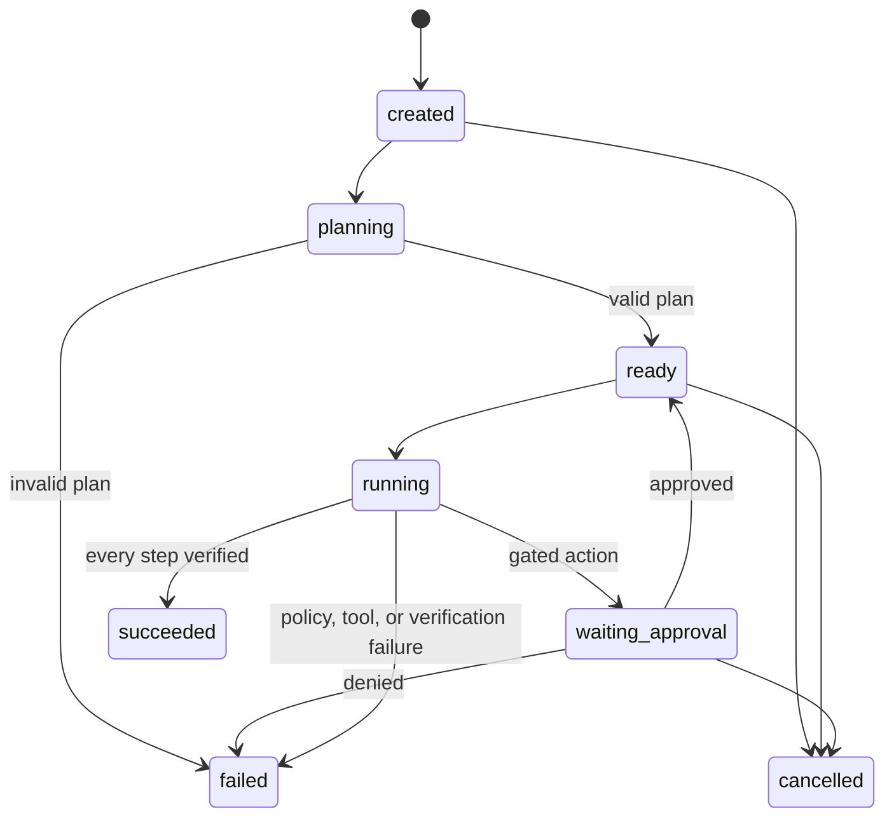

# Architecture

## Design objective

PraxisMesh must preserve a hard separation between proposing an action and authorizing an action. Model output is always untrusted input. The trust kernel is deterministic, inspectable and independently testable.

## Components

### Planner

The planner emits an `ExecutionPlan` containing typed `PlanStep` records. A step declares a registered tool, JSON-compatible arguments, dependencies, verifier and verifier configuration. It cannot emit code that is directly executed.

The deterministic planner provides reproducible offline behavior. The optional model-backed planner uses structured output to produce the same domain object.

### Plan validator

Validation occurs before a run can enter `ready`. It enforces unique step IDs, known tools, valid dependency references, no self-dependencies, an acyclic graph and a configurable maximum size.

### Orchestrator

The orchestrator owns the run state machine and is the only component allowed to advance step state. It resolves references only after upstream steps have succeeded, evaluates policy immediately before dispatch, records transitions and requires verification after dispatch.

### Policy engine

The policy engine returns one of three effects:

- `allow`: dispatch may continue;
- `require_approval`: dispatch pauses until a matching decision is recorded;
- `deny`: the run terminates safely.

Policy decisions include a risk level, reason and rule identifiers so the console and audit trace remain explainable.

### Tool runtime

Tools receive a `ToolContext` with a run ID, workspace and immutable settings. The initial tools support bounded text transformation, artifact access and optional allowlisted HTTP reads. Tools repeat critical boundary checks even after a policy allow decision.

### Verifier registry

Verifiers inspect outputs after execution. Built-in verifiers check presence, required keys, regular expressions, content and artifact digests. A step is not successful until its verifier passes.

### Persistence and audit

SQLite stores mutable operational state. The JSONL ledger stores append-only evidence, where each event hash commits to the entire event and the previous hash. Operational recovery and forensic evidence therefore have separate representations.

## Run state machine

## Reference resolution

Downstream arguments may use exact references such as `${steps.analyze.output.top_keywords}`. Resolution occurs inside the orchestrator after dependencies succeed. Missing paths are execution errors; arbitrary expressions and string evaluation are not supported.

## Scaling boundary

The first version runs one process and uses SQLite. Future distributed workers must preserve these invariants:

1. one logical lease per runnable step;
2. idempotency key per dispatch attempt;
3. durable approval decisions;
4. verification before success publication;
5. globally ordered or cell-signed evidence events;
6. resumability after worker loss.

